# Mobile header: before / after (390px)

Captured with Playwright, iPhone-width emulation (390×844, DPR 2). "Before" is `main` at c89d081; "after" is this branch.

| Page | Before | After | After, menu open |
|---|---|---|---|
| voices | 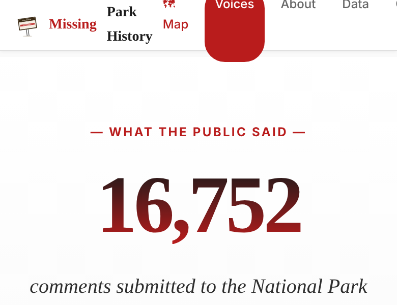 | 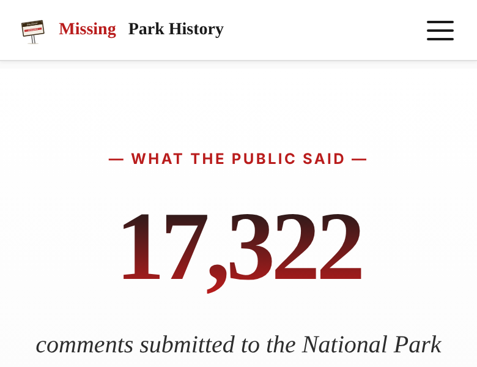 | 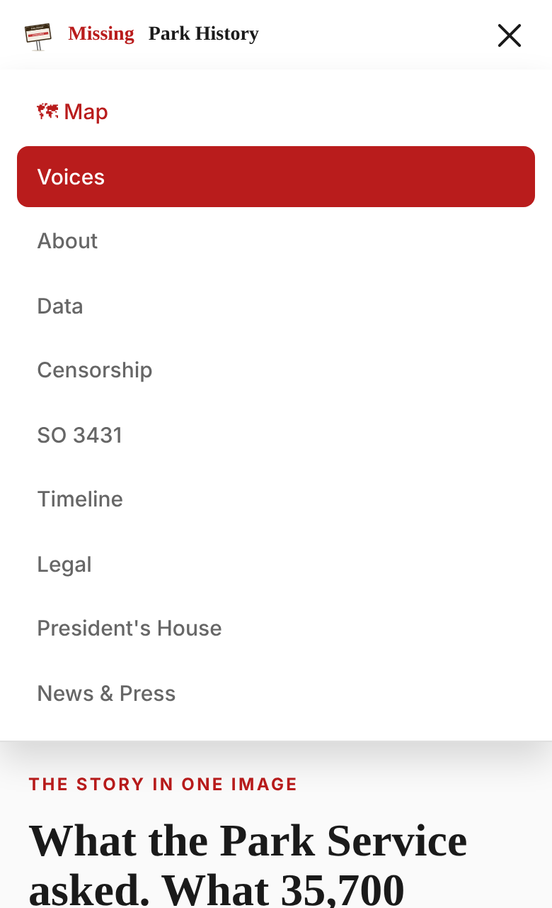 |
| park-yosemite | 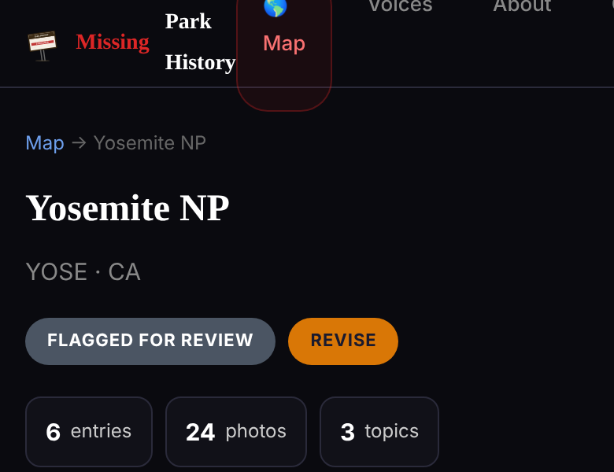 | 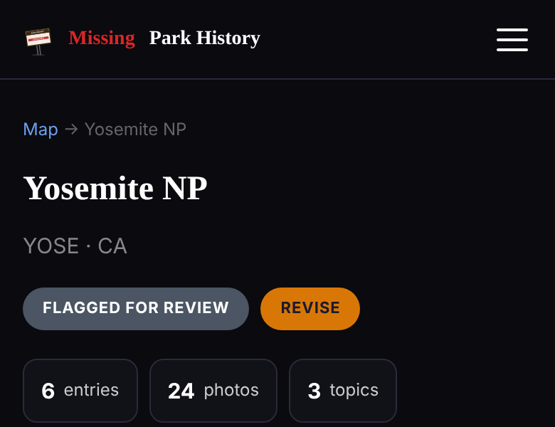 | 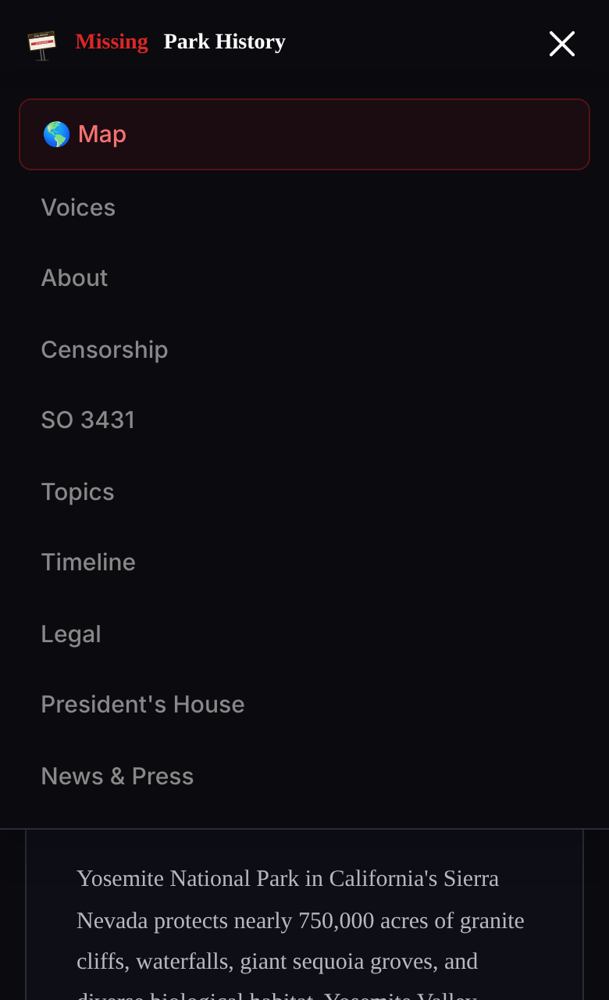 |
| about | 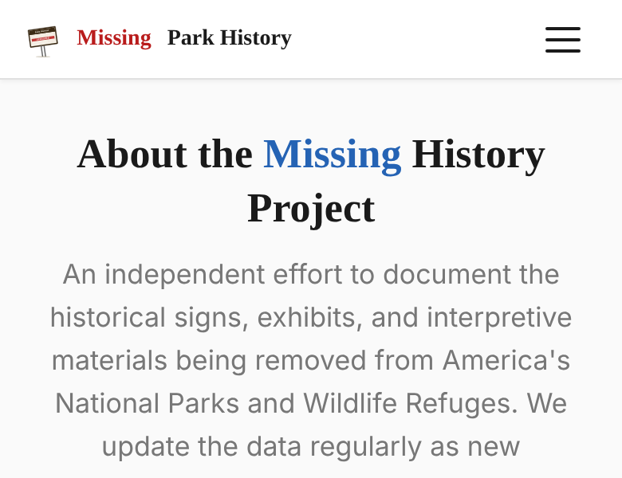 | 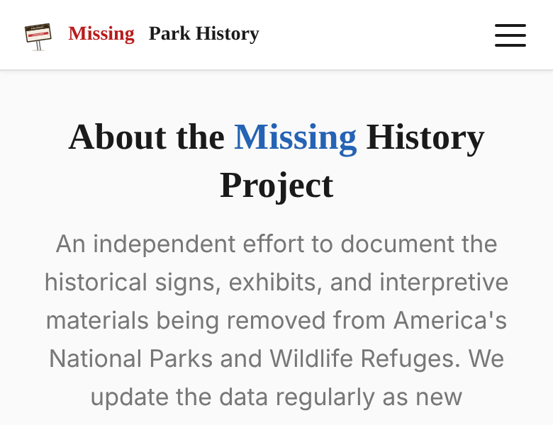 | 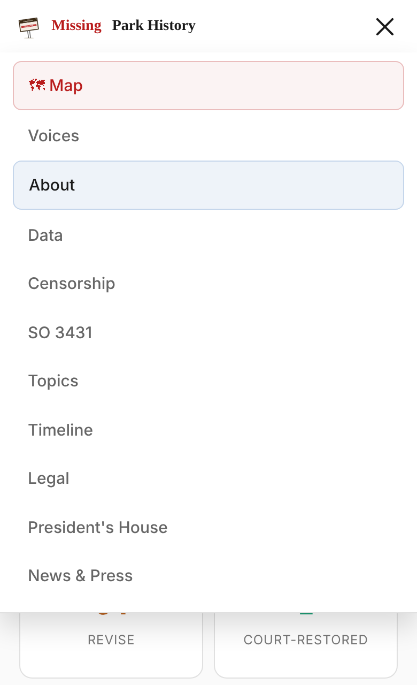 |
| news-and-press | 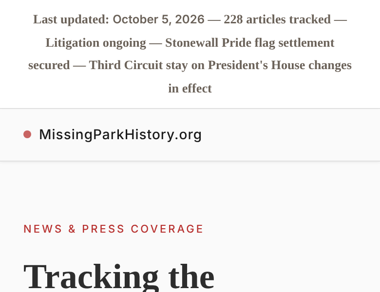 | 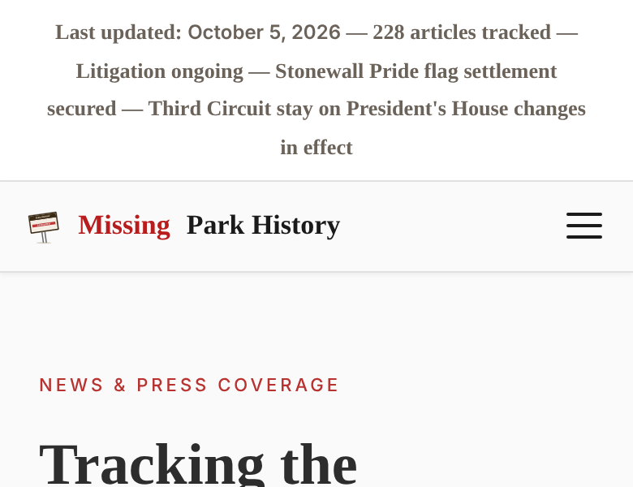 | 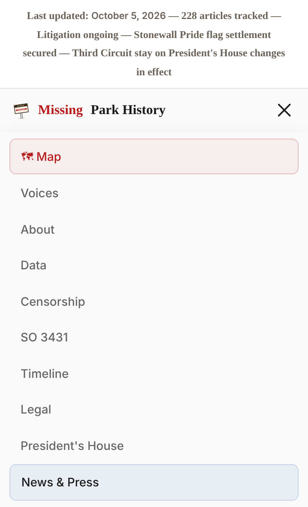 |
